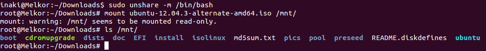

## Ejercicios 1

### Crear un espacio de nombres y montar en él una imagen ISO de un CD de forma que no se pueda leer más que desde él. Pista: en [ServerFault](http://serverfault.com/questions/198135/how-to-mount-an-iso-file-in-linux) nos explican como hacerlo, usando el dispositivo loopback

El primer paso para montar una imagen ISO de forma que únicamente se pueda leer desde un namespace concreto es crear el namespace de montaje:

    # unshare -m /bin/bash

A continuación deberá montarse el disco deseado desde el namespace creado anteriormente:

    # mount disco.iso /mnt/

----------------------------------

[-- Ejercicio 2 --](./ejercicio02.md)
