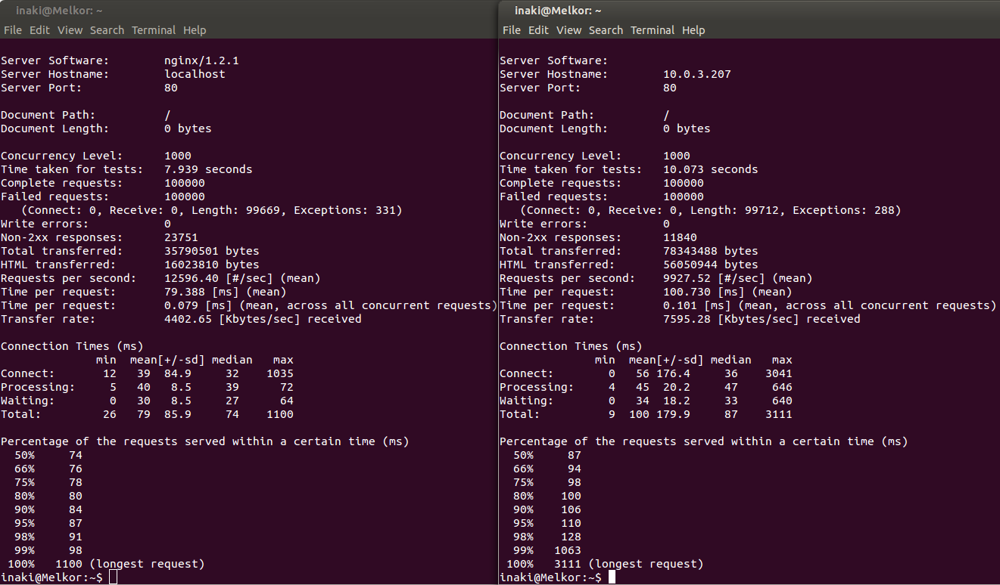

[-- Ejercicio 4 --](./ejercicio04.md)

--------------------

## Ejercicios 5

### Instalar una jaula chroot para ejecutar el servidor web de altas prestaciones nginx.

Creamos el sistema mínimo para alojar el servidor nginx:

    # mkdir -p /home/chroots/nginx/
    # debootstrap --arch=amd64 precise /home/chroots/nginx/ http://archive.ubuntu.com/ubuntu

"Chrooteamos" e instalamos nginx:

    # chroot /home/chroots/nginx/

* Sin dependencias adicionales:

        # echo "deb http://ppa.launchpad.net/nginx/stable/ubuntu precise main" > /etc/apt/sources.list.d/nginx-stable-precise.list
        # apt-key adv --keyserver keyserver.ubuntu.com --recv-keys C300EE8C

* Con `add-apt-repository`:

        # apt-get install python-software-properties
        # add-apt-repository ppa:nginx/stable
        # apt-get update && apt-get install nginx vim -y

    > Instalamos, de paso, nuestro editor de texto favorito

Iniciamos nginx:

    # service nginx start

Listo, podemos ver nginx funcionando, bien desde cualquier navegador web a la dirección IP del PC o mediante alguna herramienta de petición url estilo curl (`# apt-get install curl`), con `# curl localhost`.

--------------------

[-- Ejercicio 6 --](./ejercicio06.md)
