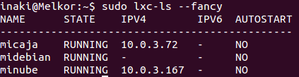
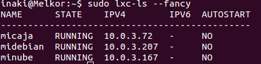

[-- Ejercicio 2 --](./ejercicio02.md)

-------------

## Ejercicios 3

### Crear y ejecutar un contenedor basado en Debian

Para crear un contenedor basado en debian:

    # SUITE=sid lxc-create -t debian -n midebian

> La variable de entorno SUITE puede ser modificada para especificar qué versión de la distribución queremos instalar (No es necesario usarla si no se tiene interés por una en concreto)

El usuario y contraseña por defecto es: root

    # lxc-start -n midebian

Si al iniciar el sistema comprobamos que no tenemos internet en nuestro contenedor,

    # lxc-ls --fancy
    

una posible solución es ejecutar desde la máquina anfitriona:

    # ethtool -K vethSSB0HF tx off

> Donde vethSSB0HF es la interfaz puente utilizada en nuestra máquina debian (brctl show). Esta solución es temporal, pues al reiniciar el sistema, la interfaz virtual asociada cambia.

> TODO: encontrar solución permanente o automatizar la ejecución de esta.

### Crear y ejecutar un contenedor basado en otra distribución, tal como Fedora. Nota En general, crear un contenedor basado en tu distribución y otro basado en otra que no sea la tuya. Fedora, al parecer, tiene problemas si estás en Ubuntu 13.04 o superior, así que en tal caso usa cualquier otra distro.

No sólo fedora tiene [problemas](./images/container_tries_error.png), en la distribución anfitriona probada (Ubuntu 12.10), no hay ningún contenedor que no fuera basado en Debian que funcionara tras probar aproximadamente una decena de ellos (quizás mala suerte).

-------------

[-- Ejercicio 4 --](./ejercicio04.md)
