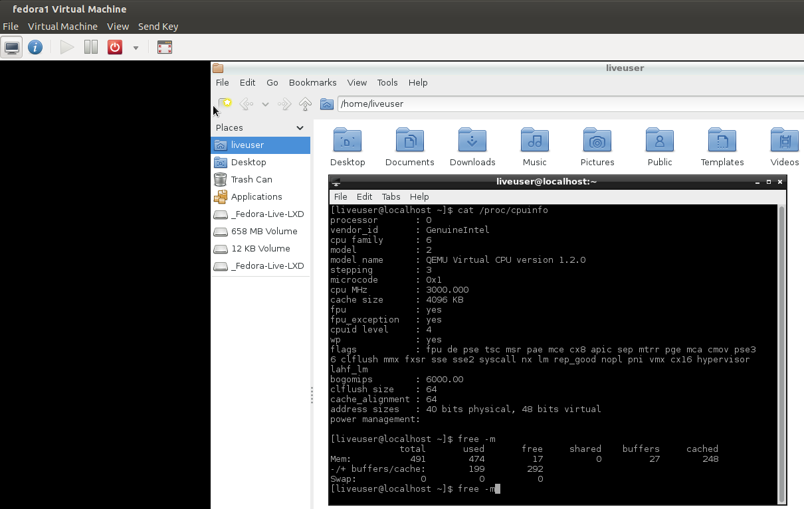

[-- Ejercicio 8 --](./ejercicio08.md)

------------------

## Ejercicios 9

### Instalar un contenedor usando virt-install.

Antes de poder realizar esta instalación debermos tener el paquete **"virtinst"** instalado en nuestro sistema:

    # apt-get install virtinst

Para crear un contenedor con virtinst:

    $ virt-install --connect qemu:///system --name=fedora1 --ram=512 --vcpu=1 --disk=/home/$USER/vms/fedora1.img,size=2 --cdrom=/home/$USER/SOs/Fedora-Live-LXDE-x86_64-19-1.iso --noautoconsole

    > --connect → Hipervisor a conectar
    > --vcpu → cpus virtuales
    > --noautoconsole → No intentar conectar directamente a la consola del contenedor

Todos los parámetros pueden encontrarse en su manual respectivo: `man virt-install`

------------------

[-- Ejercicio 10 --](./ejercicio10.md)
