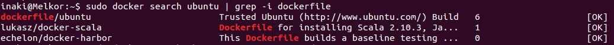
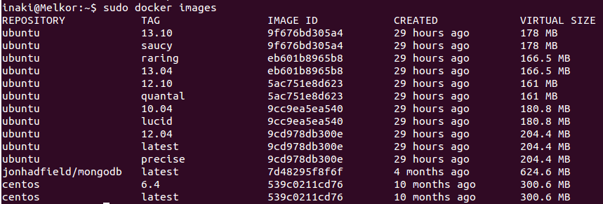

[-- Ejercicio 10 --](./ejercicio10.md)

------------------

## Ejercicios 10

### Instalar a partir de docker una imagen alternativa de Ubuntu y alguna adicional, por ejemplo de CentOS.

Para buscar imágenes disponemos del comando `# docker search <distribución>`:

    # docker search ubuntu | grep -i dockerfile

> El propio equipo dockerfile mantiene una imagen de Ubuntu

Para descargar todas las versiones del repositorio de ubuntu:

    # docker pull ubuntu

> Para especificar una versión: `# docker pull ubuntu:12.04` o `# docker pull ubuntu:latest`

Para instalar CentOS:

    # docker pull centos:latest

### Buscar e instalar una imagen que incluya MongoDB.

La buscamos:

    # docker search centos | grep -i mongodb

Y la instalamos:

    # docker pull jonhadfield/mongodb

Para ver las imágenes instaladas:

    # docker images
    

------------------

[-- Ejercicio 12 --](./ejercicio12.md)
