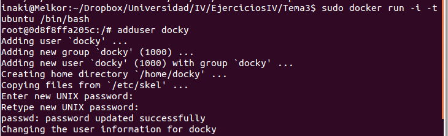

[-- Ejercicio 11 --](./ejercicio11.md)

------------------

## Ejercicios 12

### Crear un usuario propio e instalar nginx en el contenedor creado de esta forma.

Docker permite ejecutar programas de uno en uno mediante `# docker run <ID> <programa>` o `# docker run <REPO>:<TAG> <programa>, por ejemplo:

    # docker run ubuntu:latest du -sh

o mediante el uso de una shell:

    # docker run -i -t ubuntu /bin/bash

> -i de interactivo

> -t indica pseudo-terminal

Para crear el usuario, podemos usar ambos métodos, pero a continuación trabajaremos desde la shell del contenedor:

    [container]# adduser docky

> Cuando sea posible, usar adduser en lugar de useradd es más cómodo.

Finalmente, para instalar nginx:

    [container]# apt-get update && apt-get install nginx -y

------------------

[-- Ejercicio 13 --](./ejercicio13.md)
