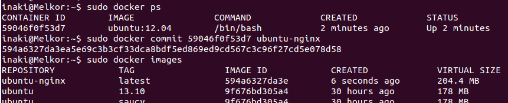

[-- Ejercicio 12 --](./ejercicio12.md)

------------------

## Ejercicios 13

### Crear a partir del contenedor anterior una imagen persistente con commit.

Crear una imagen persistente a partir del contenedor es tan sencillo como obtener su ID y "commitearlo":

    # sudo docker ps

> Obtenemos el ID

    # sudo docker commit 59046f0f53d7 ubuntu-nginx

> Creamos la imagen persistente

------------------

[-- Ejercicio 14 --](./ejercicio14.md)
