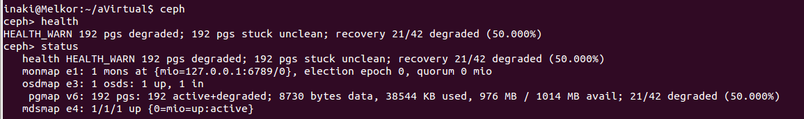
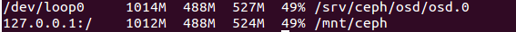

[-- Ejercicio 5 --](./ejercicio05.md)

------------------


## Ejercicios 6

### Crear un dispositivo ceph usando BTRFS o XFS.

Para crear un dispositivo usando XFS una vez instalado ceph deberemos:

1. Crear los directorios donde se almacenará la información de ceph:

        # mkdir -p /srv/ceph/{osd,mon,mds}


2. Creamos un fichero de configuración (veremos que se nos han creado directorios de configuración pero están vacíos "/etc/ceph/") en `/etc/ceph/ceph.conf`:

    ```
[global]
    log file = /var/log/ceph/$name.log 
    pid file = /var/run/ceph/$name.pid 
[mon] 
    mon data = /srv/ceph/mon/$name 
[mon.mio] 
    host = Melkor
    mon addr = 127.0.0.1:6789 
[mds] 
[mds.mio] 
    host = Melkor
[osd] 
    osd data = /srv/ceph/osd/$name 
    osd journal = /srv/ceph/osd/$name/journal 
    osd journal size = 1000 ; journal size, in megabytes 
[osd.0] 
    host = Melkor
    devs = /dev/loop0 
    ```

    > Sección [mon]: configura el monitor

    > Sección [mds]: configura el servidor de metadatos

    > Sección [osd]: configura el dispositivo servidor de objetos


    > mio: nombre corto que asignamos a la máquina

    > Melkor: nombre local de nuestra máquina ($ echo $HOSTNAME)


3. Para crear el dispositivo **XFS** tenemos que crear el directorio a mano:

        # mkdir /srv/ceph/osd/osd.0


4. Para finalizar con nuestra configuración creamos el sistemas de ficheros de objetos con:

        # mkcephfs -a -c /etc/ceph/ceph.conf

    > Sorpresa: ** ERROR: error creating empty object store in /srv/ceph/osd/osd.0: (95) Operation not supported

    Al parecer no solo hay que crear el directorio a mano sino montar, en éste, un dispositivo con el sistema de ficheros (xfs) que vamos a utilizar, por ejemplo:

        # mount -o loop xfs.img /srv/ceph/osd/osd.0/

    Ahora ya está todo listo para crear el sistema de ficheros de objetos:

        # mkcephfs -a -c /etc/ceph/ceph.conf
        # /etc/init.d/ceph -a start

    > Si al intentar crear el sistema nos devuelve "** ERROR: error creating empty object store in /srv/ceph/osd/osd.0: (22) Invalid argument", posiblemente se deba a que `/srv/ceph/osd/osd.0/` ya dispone de un sistema de objetos creado. Eliminar su contenido primero.


5. Comprobamos que está en pie:

        $ ceph -s

    

6. Montamos nuestro nuevo sistema de ficheros de objetos:

        # mount -t ceph localhost:/ /mnt/ceph/

    

------------------

[-- Ejercicio 7 --](./ejercicio07.md)
