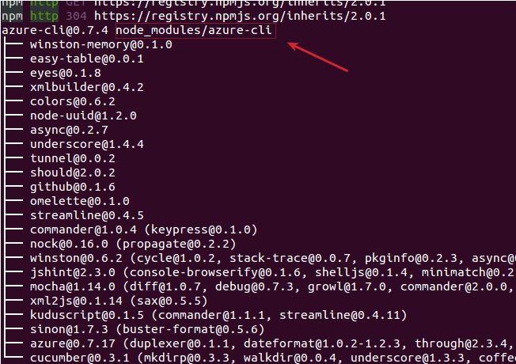
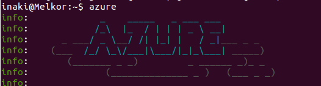
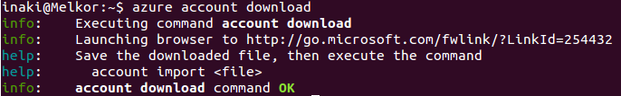
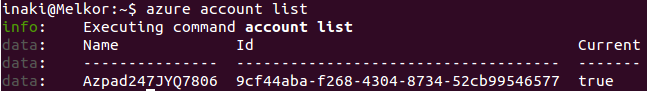
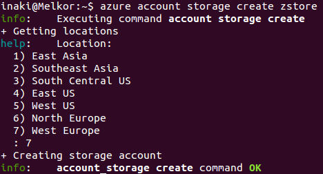

[-- Ejercicio 7 --](./ejercicio07.md)

------------------

## Ejercicios 8

### Tras crear la cuenta de Azure, instalar las [herramientas de línea de órdenes (Command line interface, cli) del mismo](http://www.windowsazure.com/en-us/manage/install-and-configure-cli/) y configurarlas con la cuenta Azure correspondiente

Para instalar la CLI de Azure una vez registrados deberemos:

Instalar npm y nodejs:
    
    # add-apt-repository ppa:chris-lea/node.js -y && apt-get update
    # apt-get install npm nodejs

Instalar la CLI de azure bajo npm:

    # npm install azure-cli -g

> Utilizamos el -g para que se realice una instalación "global". De lo contrario la instalación se realizará en un subdirectorio del directorio actual, tal como indica la imagen.

#### Utilizando azure:

Descargamos configuración de cuenta:

    $ azure account download

> Aunque la información que veremos parece que sean acciones que ha realizado, son instrucciones

Abrimos el link "http://go.microsoft.com/fwlink/?LinkId=254432" en un navegador, guardamos el fichero que nos proporciona para descargar y lo importamos a azure:

    $ azure account import Azpad******.publishsettings

> Este fichero contiene información sensible por lo que, o bien se guarda en lugar seguro, o bien se elimina: `$ rm Azpad******.publishsettings`

Podemos comprobar nuestra nueva cuenta:

    $ azure account list
    

Creamos cuenta de almacenamiento

    $ azure account storage create zstore

> Al parecer el nombre no puede contener mayúsculas (error:   parameters.serviceName is outside the valid range.) ni dígitos (error:   Error).

Para obtener las claves necesarias para gestionar este almacenamiento:

    $ azure account storage keys list zstore

Estas claves deberán añadirse a las variables de entorno correspondientes:

    $ export AZURE_STORAGE_ACCOUNT=zstore
    $ export AZURE_STORAGE_ACCESS_KEY=bLz8TtE******************==

------------------

[-- Ejercicio 9 --](./ejercicio09.md)
