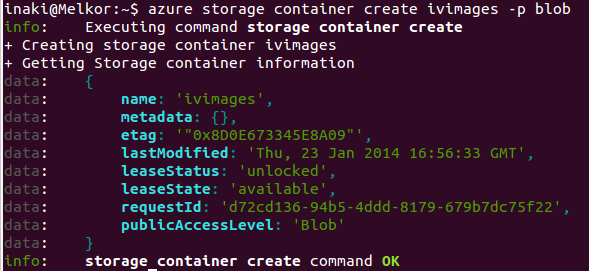
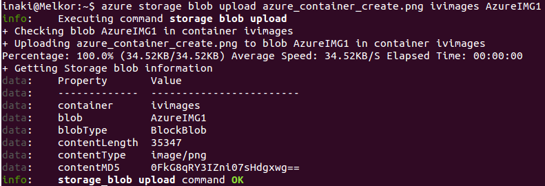
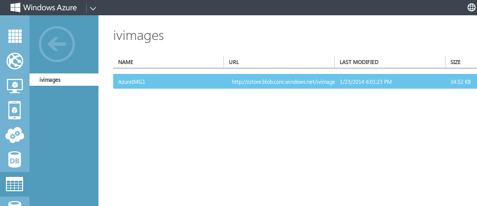

[-- Ejercicio 8 --](./ejercicio08.md)

------------------

## Ejercicios 9

### Crear varios contenedores en la cuenta usando la línea de órdenes para ficheros de diferente tipo y almacenar en ellos las imágenes en las que capturéis las pantallas donde se muestre lo que habéis hecho.

Creamos un contenedor público:

    $ azure storage container create ivimages -p blob
    

Subimos un fichero:

    $ azure storage blob upload azure_container_create.png ivimages AzureIMG1

> El fichero azure_container_create.png, cuyo nombre de blob será AzureIMG1

Comprobamos que todo está funcionando como la teoría dice metiéndonos en nuestra cuenta:

------------------

[-- Ejercicio 10 --](./ejercicio10.md)
