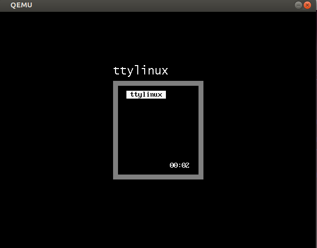
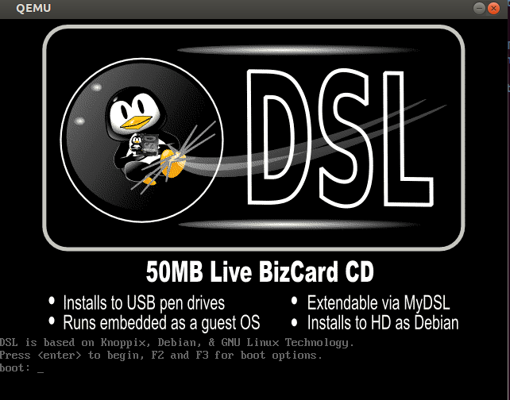
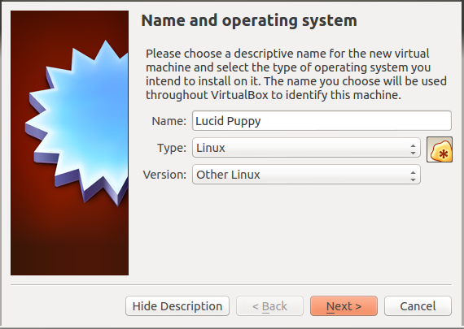
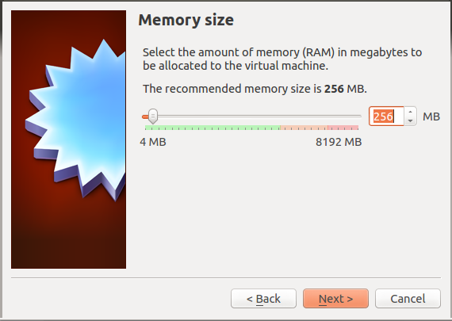
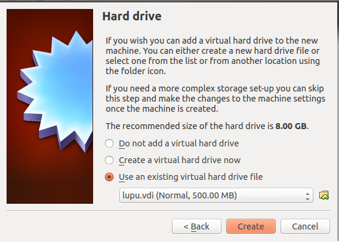
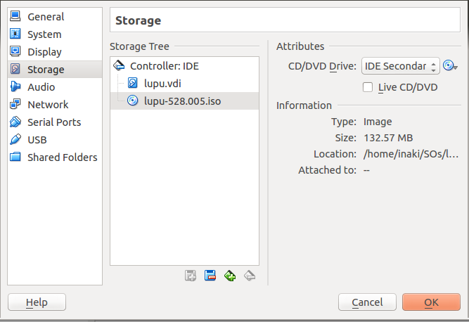
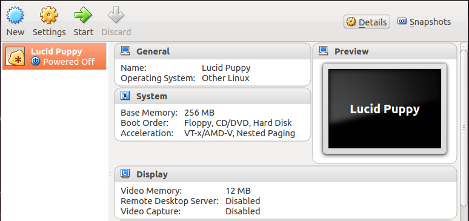
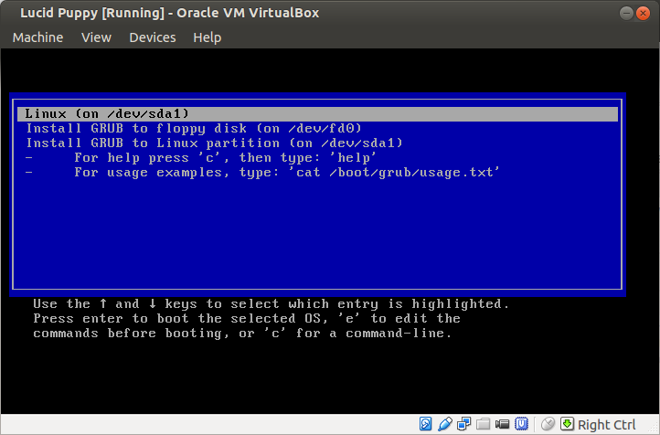

[-- Ejercicio 1 --](./ejercicio01.md)

------------------

## Ejercicios 2

### Crear varias máquinas virtuales con algún sistema operativo libre, Linux o BSD. Si se quieren distribuciones que ocupen poco espacio con el objetivo principalmente de hacer pruebas se puede usar [CoreOS](http://coreos.com/) (que sirve como soporte para Docker) [GALPon Minino](http://minino.galpon.org/en), hecha en Galicia para el mundo, [Damn Small Linux](http://www.damnsmalllinux.org/download.html), [SliTaz](http://www.slitaz.org/en/) (que cabe en 35 megas) y [ttylinux](http://ttylinux.net/) (basado en línea de órdenes solo).

Para este ejercicio instalaremos 2 sistemas distintos, **ttylinux** y **DamnSmallLinux**

##### Ttylinux:

Lo primero será crear el fichero de almacenamiento virtual:

    $ qemu-img create -f raw diskimage.img 200M

A continuación iniciaremos la máquina especificándole la imagen creada anteriormente y el"disco" de instalación:

    $ qemu-system-x86_64 -hda diskimage.img -cdrom ~/SOs/ttylinux-virtio_x86_64-16.1.iso

##### DamnSmallLinux (DSL):

Repetimos los pasos anteriores:

    $ qemu-img create -f raw dsl.img 200M
    $ qemu-system-x86_64 -hda dsl.img -cdrom ~/SOs/dsl-4.11.rc1.iso

### Hacer un ejercicio equivalente usando otro hipervisor como Xen, VirtualBox o Parallels.

A continuación utilizaremos la aplicación Virtualbox. Un software de virtualización que, aunque no es el que mejores resultados en cuestión de rendimiento suele dar, sí que es muy fácil de utilizar, dispone de infinidad de funcionalidades interesantes y sobre todo, es software libre:

    # echo "deb http://download.virtualbox.org/virtualbox/debian `lsb_release -sc` contrib" >> /etc/apt/sources.list
    # wget -q http://download.virtualbox.org/virtualbox/debian/oracle_vbox.asc -O- | apt-key add -
    # apt-get update
    # apt-get install virtualbox-4.3

La versión por defecto al instalar el paquete "virtualbox" es, normalmente, la de los repositorios oficiales de nuestra distribución, por lo tanto, para descargar la última versión (de los repositorios propios de virtualbox), debemos indicar claramente que queremos ese paquete de instalación (visible con `$ apt-cache policy <app>`) o bien descargarlo de la web oficial.

* Configuramos la máquina virtual

    

* Especificamos la memoria RAM

    

* Especificamos el dispositivo de almacenamiento (podemos elegir crear uno o usar uno ya creado)

    

* "Insertamos" el "disco"

    

* Ya creada y configurada la máquina, la iniciamos con el botón "Start"

    

* Instalamos el sistema en el dispositivo de almacenamiento

    

------------------

Puede ver más imágenes de los procesos de instalación de:

* [TtyLinux](./images/ttylinux)
* [DamnSmallLinux (DSL)](./images/dsl)
* [Puppy](./images/puppy)

------------------

[-- Ejercicio 3 --](./ejercicio03.md)
