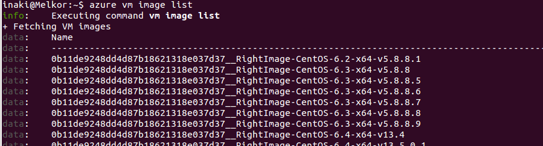
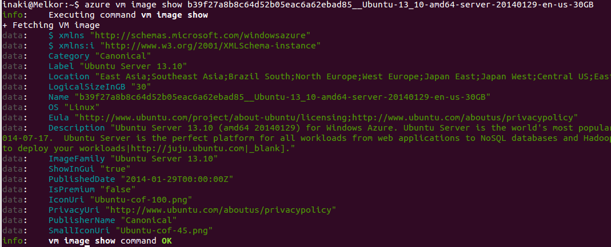
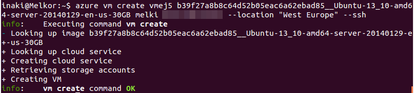
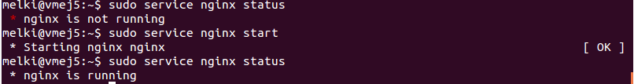
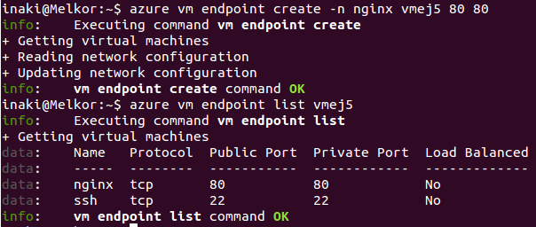
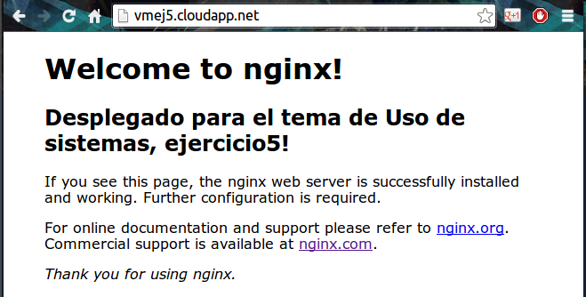

[-- Ejercicio 4 --](./ejercicio04.md)

------------------

## Ejercicios 5

### Crear una máquina virtual ubuntu e instalar en ella un servidor nginx para poder acceder mediante web.

Antes de instalar una máquina virtual en azure debemos saber qué máquina instalar:

    $ azure vm image list
    

Para ver más infromación de una máquina podemos usar:

    $ azure vm image show b39f27a8b8c64d52b05eac6a62ebad85__Ubuntu-13_10-amd64-server-20140129-en-us-30GB
    

Y para crearla:

    $  azure vm create vmej5 b39f27a8b8c64d52b05eac6a62ebad85__Ubuntu-13_10-amd64-server-20140129-en-us-30GB melki <pass_WD1=> --location "West Europe" --ssh

> Las localizaciones disponibles pueden verse con el `azure vm image show`

> Indicamos que queremos acceder a ella por ssh

> Recomendable dejar un espacio antes de ejecutar el comando, de esta forma no se guarda la contraseña en nuestro historial de bash

Nos conectamos a la máquina creada con:

    $ ssh melki@vmej5.cloudapp.net

Instalamos nginx

    [vmej5]# apt-get install nginx
    

Le "abrimos el puerto" mediante los llamados "EndPoints" de azure:

    $ azure vm endpoint create -n nginx vmej5 80 80

> el parámetro -n nos permite darle un nombre, en caso de no hacerlo el nombre en esta ocasión 	para el endpoint será: tcp-80-80

> Podemos ver los endpoints con `azure vm endpoint list vmej5`

    
Comprobamos que, efectivamente, tenemos nginx accesible y en marcha (`curl vmej5.cloudapp.net`):

------------------

[-- Ejercicio 6 --](./ejercicio06.md)
