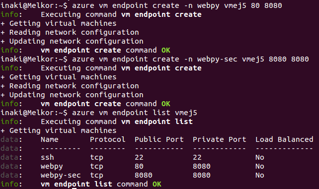
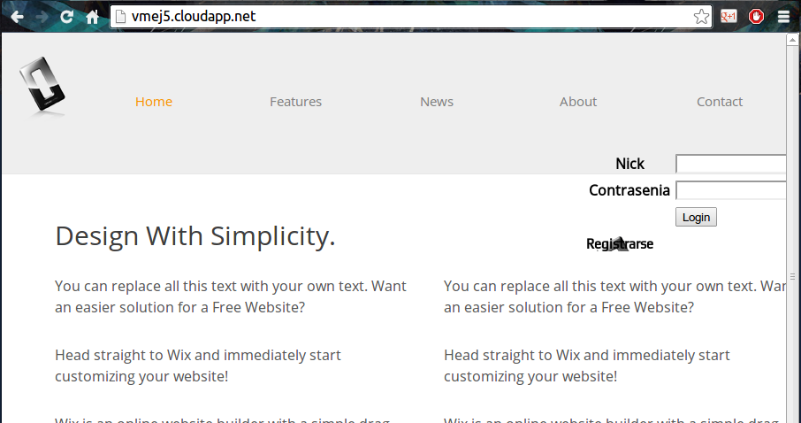

[-- Ejercicio 4 --](./ejercicio04.md)

------------------

## Ejercicios 5

### Desplegar la aplicación de DAI con todos los módulos necesarios usando un playbook de Ansible.


Para este despliegue iremos un poquito más allá en la configuración de ansible, separando la configuración en varios ficheros:
* [hosts](./daibook/hosts)

```
[azure]
vmej5.cloudapp.net nickname=allinone vm=0 branch=master
```

* [variables](./daibook/vars.yml)

```
---
project_root: /var/www/
project_repo: https://github.com/FdezI/DAIpr3.git
upstart_service: webpy
hosts_user: melki
system_packages:
  - git
  - python
  - python-dev
  - python-pip
  - python-webpy
  - mongodb
python_modules:
  - pymongo
  - feedparser
  - tweepy
  - mako
```

* [provisionamiento](./daibook/provision.yml)

```
- hosts: azure
  vars_files:
    - vars.yml
  remote_user: "{{ hosts_user }}"
  sudo: yes
  tasks:
    - name: Instalar depedencias
      apt: pkg={{ item }} state=installed update-cache=yes
      with_items: ${system_packages}
    - name: Instalar módulos de python
      pip: name={{ item }}
      with_items: ${python_modules}
- include: deploy.yml
```

* [despliegue](./daibook/deploy.yml)

```
- hosts: azure
  vars_files:
    - vars.yml
  remote_user: "{{ hosts_user }}"
  sudo: true
  gather_facts: false
  tasks:
    - name: Crear directorio de proyecto
      file: state=directory path={{ project_root }}
    - name: Desplegar código
      git: repo={{ project_repo }} dest={{ project_root }} version={{ branch }}
    - name: Estableciendo permisos
      shell: chown -R www-data:www-data {{ project_root }}
    - name: Creando servicio Upstart
      template: src=templates/webpyupstart.conf dest=/etc/init/{{ upstart_service }}.conf owner=root group=root mode=0644
    - name: Iniciar aplicación
      notify: restart {{ upstart_service }}

  handlers:
    - include: handlers.yml
```

* [handlers](./daibook/handlers.yml)

```
---
- name: restart {{ upstart_service }}
  service: name={{ upstart_service }} state=restarted
  sudo_user: root
```

Además, para ejecutar este **playbook** crearemos un script de arranque:

* [ansible](./daibook/ansible)

        /usr/bin/env ansible-playbook -i hosts "$@"


De esta forma será más sencillo modificar o añadir acciones y tenerlo todo modularizado, además de poder realizar acciones según la necesidad, de forma que:

    $ ./ansible provision.yml

> Provisiona y despliega

    $ ./ansible deploy.yml

> Despliega únicamente


Para poder acceder desde el exterior configuraremos un **endpoint de azure**:

    $ azure vm endpoint create -n webpy vmej5 80 8080




------------------

##### Problemas

En un principio, para iniciar el comando lo convertí en una tarea asíncrona de ansible, tal y como se cuenta en la [documentación oficial](http://docs.ansible.com/playbooks_async.html). Esto, desgraciadamente, no funciona para tareas que queremos que estén corriendo de forma "infinita", ya que al completarse el tiempo especificado en "async" se cierra automáticamente el proceso por mucho que se establezca a 0 el chequeo de aplicación en marcha ("poll"). Por ello, una opción es convertir nuestro proceso en un "servicio upstart", permitiendo así iniciar/detener el servicio mediante el comando `# service <servicio> start/stop`

Para ello creamos el [script de "upstart"](./daibook/templates/webpyupstart.conf) y lo usamos con el módulo **template** de ansible para crear el fichero remoto:

```
stop on runlevel [!2345]

# Restart si crashea
respawn

script
    cd /var/www/
    sudo -u www-data python ejercicio4_2.py 8080
end script
```





------------------

> Ayuda obtenida de: http://www.stavros.io/posts/example-provisioning-and-deployment-ansible/

------------------

[-- Ejercicio 6 --](./ejercicio06.md)
