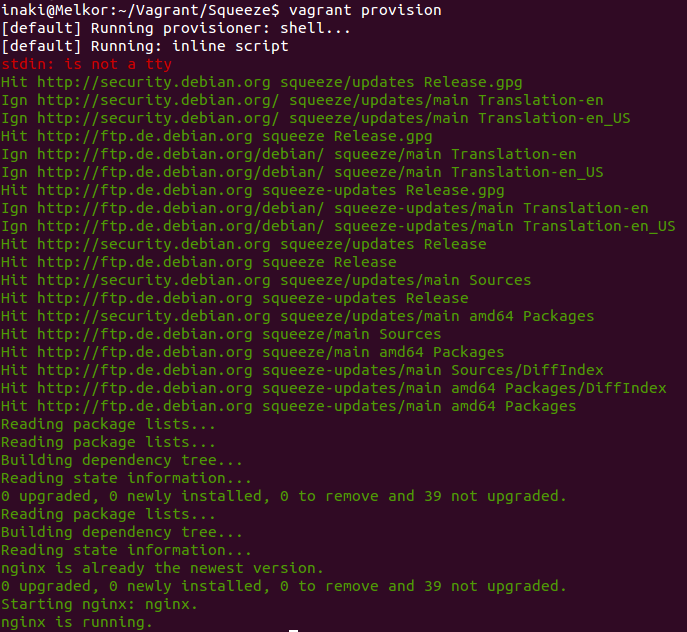
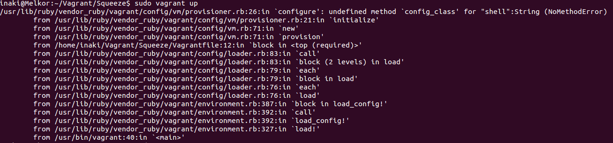

[-- Ejercicio 6 --](./ejercicio06.md)

------------------

## Ejercicios 7

### Crear un script para provisionar **nginx** o cualquier otro servidor web que pueda ser útil para alguna otra práctica.

Para provisionar un servidor web, tal como nginx, no es necesario realizar un script adicional más allá de la misma configuración propia del **"Vagrantfile"**, haciendo uso del provisionador **shell**. Éste permite especificar acciones a ejecutar en la shell de la máquina a provisionar una vez iniciada.

Basta con añadir a la configuración:

```
config.vm.provision "shell", 
    inline: "apt-get update && apt-get install nginx -y && service nginx restart"
```

Aún así, si lo que queremos es un [script](./scripts/vnginxprovision.sh), tan sólo habría que crear un script con dicho contenido y llamarlo con el provisionador **shell** de la siguiente forma:

    config.vm.provision "shell", path: "ruta/del/script.sh"

> La ruta puede ser local o una dirección remota usando su URL


El provisionamiento se lleva a cabo tanto al iniciar la máquina `$ vagrant up` como al provisionarla explícitamente:

    $ vagrant provision




##### En caso de encontrar el error:



Seguramente se deba a la versión disponible en los repositorios oficiales de nuestra distribución (en este caso: **1.0**). Para solucionarlo basta con descargar la [última versión oficial](http://www.vagrantup.com/downloads.html) e instalarla.

------------------

> Documentación oficial: http://docs.vagrantup.com/v2/

------------------

[-- Ejercicio 8 --](./ejercicio08.md)
